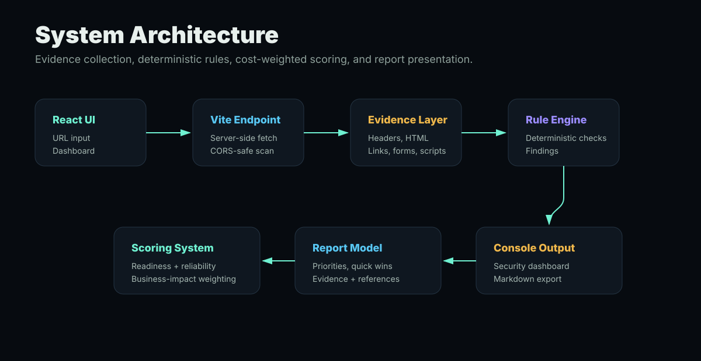
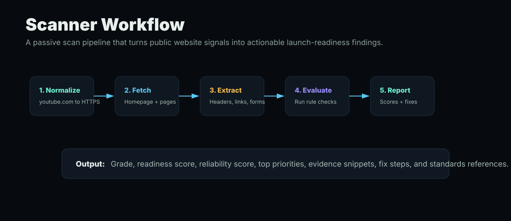
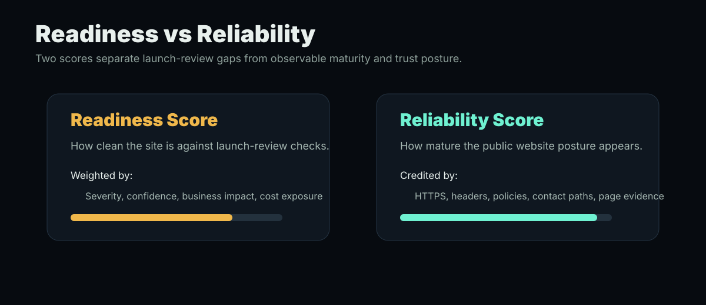

# Aegis Web Review

Aegis Web Review is a pre-launch trust, security, privacy, compliance-risk, and AI-safety scanner for AI-generated websites.

The project is built for developers and founders who use tools like ChatGPT, v0, Lovable, Bolt, Cursor, Replit, and other AI website builders. AI-generated sites can look polished while still missing important trust signals such as Terms of Service, Privacy Policy, security headers, cookie disclosures, form data-use language, AI disclaimers, and risky-claim controls.

Aegis performs passive public-page review, generates evidence-backed findings, and presents a professional launch-readiness report.

> This project identifies risk signals. It is not legal advice, a compliance certification, or a penetration test.

## What It Does

- Scans public website URLs.
- Accepts bare domains like `youtube.com` and normalizes them to `https://youtube.com`.
- Fetches the homepage and selected important internal pages.
- Reviews security, privacy, compliance-risk, and AI trust signals.
- Generates a readiness score and letter grade.
- Generates a separate reliability score for mature observable website posture.
- Provides severity, confidence, business impact, evidence snippets, and fix steps.
- Links findings to relevant standards, laws, and guidance for further research.
- Saves browser-local scan history.
- Exports reports as Markdown.

## Key Features

### Website Scanner

Aegis passively collects observable website evidence:

- Final URL and status code.
- HTTP response headers.
- HTML content.
- Visible page text.
- Internal links.
- External scripts.
- Forms.
- Tracking script signals.
- Important internal pages such as privacy, terms, contact, pricing, login, signup, cookie, refund, and about pages.

### Risk Categories

Findings are grouped into four domains:

- **Security**: HTTPS, browser security headers, hardening gaps.
- **Privacy**: Privacy Policy, tracking disclosure, forms, data-use notices.
- **Compliance**: Terms of Service, refund/cancellation language, risky claims, contact paths.
- **AI Trust**: AI disclaimers, AI limitation language, regulated-topic risk, overreliance on generated output.

### Scoring

Aegis uses two scores:

- **Readiness Score**: How clean the site is against Aegis launch-review checks.
- **Reliability Score**: How strong the site's observable maturity and trust posture appears from public evidence.

The readiness score is cost-weighted. Findings that could create legal cost, customer disputes, platform review issues, user trust problems, or exploitable security exposure reduce the score more heavily.

### Compliance References

Each finding can include links to research starting points such as:

- OWASP Secure Headers Project.
- FTC Privacy and Security Guidance.
- FTC Advertising and Marketing Guidance.
- California Consumer Privacy Act.
- EU GDPR text.
- NIST AI Risk Management Framework.
- WCAG accessibility guidelines.

These links help users research what may apply to them. Aegis does not claim that a specific law has been violated.


## Visual Overview

### System Architecture



### Scanner Workflow



### Scoring Model



## Tech Stack

| Layer | Tool | Purpose |
| --- | --- | --- |
| Frontend | React | Interactive dashboard UI |
| Language | TypeScript | Structured report and finding models |
| Build tool | Vite | Fast dev server, build pipeline, local scanner middleware |
| Runtime | Node.js | Server-side website fetching during local development |
| Styling | CSS | Dark security-console interface |
| Package manager | npm | Dependency and script management |
| Documentation | Markdown | GitHub-ready technical docs and exported reports |

## Run Locally

From WSL / Ubuntu:

```bash
cd "/mnt/c/Users/shohiwa/Documents/AI vulnerability scanner 2"
npm install
npm run dev
```

Open the URL Vite prints, usually:

```text
http://localhost:5173
```

Build for production:

```bash
npm run build
```

## Project Structure

```text
.
+-- docs/
¦   +-- ARCHITECTURE.md
¦   +-- GITHUB_SETUP.md
¦   +-- IMPLEMENTATION_LOG.md
¦   +-- PROJECT_BRIEF.md
¦   +-- RESUME_NOTES.md
¦   +-- ROADMAP.md
¦   +-- SCORING_MODEL.md
¦   +-- SECURITY_AND_COMPLIANCE_SCOPE.md
¦   +-- USAGE_GUIDE.md
+-- src/
¦   +-- App.tsx
¦   +-- main.tsx
¦   +-- styles.css
+-- index.html
+-- package.json
+-- tsconfig.json
+-- vite.config.ts
```

## Safety Boundary

Aegis is intended for authorized, passive review only. Use it on:

- Websites you own.
- Client sites you have permission to review.
- Test projects.
- Demo websites.
- Intentionally vulnerable sample websites.

Do not use this project for exploitation, credential attacks, denial-of-service activity, bypassing access controls, or scanning systems without authorization.

## Resume Summary

Built Aegis Web Review, a React and TypeScript launch-readiness scanner for AI-generated websites. The platform passively scans public pages, extracts security/privacy/compliance/AI-trust signals, generates cost-weighted findings with evidence snippets and remediation steps, links findings to relevant standards and guidance, and presents results in a polished security-console dashboard.

## Roadmap

Planned improvements:

- Policy-page content analysis.
- Before/after scan comparison.
- Saved project workspaces.
- More detailed AI-risk checks.
- Screenshot capture for reports.
- PDF export.
- Hosted deployment.
- Optional AI-assisted remediation explanations.

